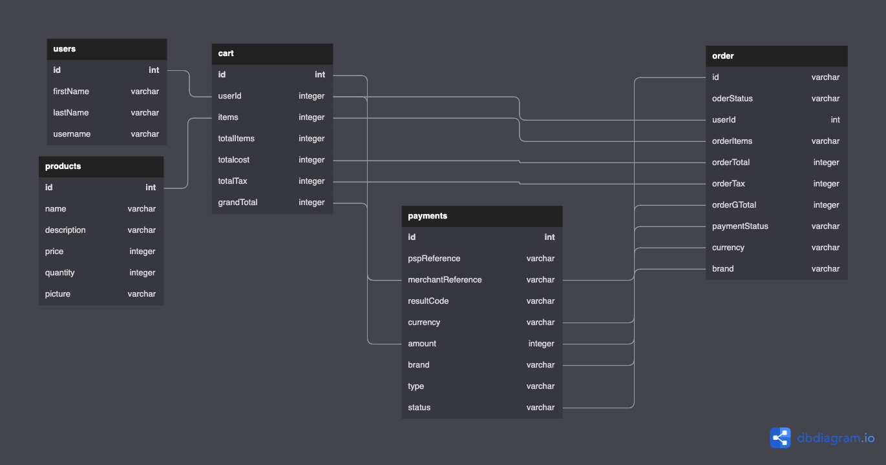

# Psychic-guacamole
A personal project focused on creating a personal API. This will focus on integrating the Adyen API for processing transactions. 

Be on the lookout for weekly updates.

***
### **UML Diagram:**

***
### **Technologies used:**
<ul>
<li>NodeJS</li>
<li>Express</li>
<li>Sequelize</li>
<li>Postgress</li>
<li>Nodemon</li>
<li>React</li>
<li>Javascript</li>
<li>Vanilla CSS</li>
</ul>

***
### **How to Run Locally:**
<ol>
<li>Fork the repository</li>
<li>Clone the copy locally</li>
<li>CD into the repository and run this command on the terminal:
`npm install`  
*This will install the dependencies</li>
<li>run this command on the terminal: npm start
* To start the back end</li>
<li>TBD</li>
<li>TBD</li>
</ol>
